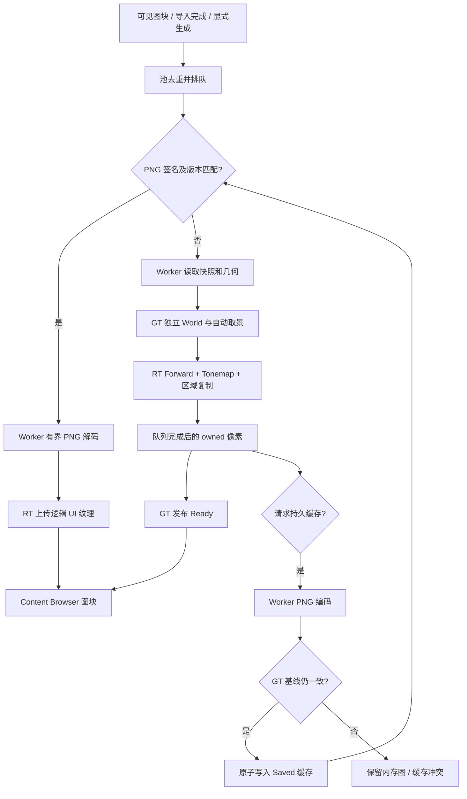

# Asset 缩略图设计

## 1. 范围与状态

StaticMesh 已接入独立预览、共享 Forward/Tonemap、多个 ImGui 逻辑纹理、异步颜色读回、外部 PNG 缓存、有界内存池与 Content Browser 图块。Texture2D 图块由资产 Mip 生成内存缩略图；独立贴图窗口查看原始 Mip 和 RGBA/R/G/B/A 通道。职责划分参考 UE4.27 的预览与缩略图边界，资产持久化以 [Asset 描述与处理数据格式](asset-pair-format-design.md) 为准。

模型使用现有默认材质。材质/动画/碰撞/场景缩略图和材质依赖加载尚未实现；以后每种资源提供自己的预览策略，共用缓存、图片格式和 UI 纹理通道。源文件拖入与导入确认框属于 [StaticMesh 导入交互](static-mesh-import-design.md#7-editor-导入与拖放交互)，成功发布后调用本模块生成缩略图。

材质与单层实例的后续接入遵循[代码材质设计](material-system-design.md#9-预览缩略图与线程生命周期)：活动预览优先使用现有 preview scene，后台图片等待其使用权释放；共用逻辑纹理 ID 分配/退休路径。交互显示不强制颜色读回，缩略图仍取得 owned 像素。材质图片签名包含 parent、Shader 和纹理内容；未保存草稿仅用于内存预览。当前模型没有默认材质 AssetRef，场景 Actor 的材质 override 不回写模型缩略图；以后模型正式保存该依赖时才扩展模型源签名。本段为拟实施扩展，现有池仍只处理 StaticMesh。

规范边界见 [资源基础](editor-resource-foundation-design.md)、[StaticMesh 生产链](static-mesh-import-design.md)、[Application](application-design.md)、[RHI](rhi-design.md) 和 [Game/Render contract](../openspec/specs/game-render-framework/)。

## 2. 目录与依赖

| 位置 | target / 职责 |
| --- | --- |
| `engine/core/hash` | `Toy3dHash`；迁移原 Shader SHA-256，内容签名共用算法 |
| `engine/core/image_codec` | `Toy3dImageCodec`；有界内存 PNG 编解码，复用已有 stb |
| `engine/core/asset_thumbnail` | `Toy3dAssetThumbnail`；内容签名，依赖 Resource/Hash，不依赖 PNG/渲染器 |
| `engine/core/asset/asset_pair_store.*` | 新资产成对发布；缩略图缓存不经过资产发布 |
| `engine/core/static_mesh` | 同一快照的只读模型解码，允许未知可选外层段 |
| `engine/runtime/ui/ui_texture_work.h` | GT/RT 间 owned 上传、预览请求、退休 ID 和图片结果 |
| `engine/runtime/renderscene/ui/ui_texture_registry.*` | RT 独占的逻辑 ID 到 RHI texture/view 映射 |
| `engine/editor/source/thumbnails` | GT 缩略图池、独立预览 World、Worker 和保存策略 |
| `engine/editor/source/panels/content_browser_panel.*` | 目录树、可见图块、占位和生成入口 |

Core 不依赖 Runtime、Editor 或 ImGui；离线 importer 不依赖 Editor。Runtime 模型加载不需要 PNG；关闭 Assimp 导入不影响已有 `.asset` 的预览和 PNG 显示。Editor 行为留在 Editor target，没有通过宏改变共享 DTO 布局；以后 runtime 的 Editor 行为和数据分别使用 `WITH_EDITOR` / `WITH_EDITORONLY_DATA`。

## 3. 缓存格式与失效

Hash 和 PNG 借用 const 输入，只在成功时发布调用者拥有的输出，各次调用使用独立局部状态，可并行处理不同输出。PNG 不提供通用格式导入、文件访问、色彩管理或全局 flip 配置；第三方细节只在 codec 实现。SHA 迁移后删除原 Shader 算法入口，既有 ShaderMap key 和标准向量保持不变。

资产不含 `thumbnail_source` 或 `thumbnail` 段。Editor 将 PNG 存于 `/Saved/AssetThumbnails/<AssetId>-<内容签名>-v<生成器版本>.png`。

源签名按固定名称顺序对带长度边界的 `type_data`、`render_geometry` 与领域预览版本计算 SHA-256，不包含偏移、路径、导入源数据或缩略图本身。生成器版本涵盖取景、材质、背景、曝光和相关 Shader 策略，改变时升级版本。将来预览使用材质依赖时，源签名须增加依赖内容签名。

Importer 只发布模型描述和几何。缩略图 Worker 从已发布的模型内容计算签名，缓存写入者不改资产；模型变化自然形成新缓存键。未来预览使用材质依赖时，签名须纳入依赖内容。

Content Browser 图块与生成的缩略图固定为 128×128，不提供动态尺寸设置。StaticMesh PNG 缓存生成器版本为 2，旧 256×256 图片不会命中；通用 PNG codec 仍允许每边 1～512、PNG 最大 4 MiB。缩略图为 top-left、紧凑 RGBA8、已编码 sRGB、alpha=255。PNG codec 校验 signature、chunk 长度/CRC、IEND 和无尾随数据，先检查尺寸再分配，失败不修改输出。缓存 loader 检查 PNG 实际尺寸，源签名与版本由文件名验证。

## 4. 图片加载与独立预览

命中时 Worker 验证资产配对并计算内容签名，再读取缓存 PNG，解码并转换 BGRA8 上传，不创建预览 Actor。缺失、损坏或版本不匹配则读取有界几何快照生成；缓存更新不修改资产。

`decode_static_mesh_asset(bytes)` 在同一快照中检查 root/schema、已知必需段、元数据/几何和材质槽一致性。未知必需段拒绝；未知可选外层段允许只读预览，写回保留其原始字节。未知 typed 字段仍由当前 schema decoder 拒绝，此入口不授权有损 typed 保存。

Engine 根据 `Application::uses_preview_scene()` 在启动时配置独立预览 RenderScene，Renderer 在 RT 创建并拥有主/预览 RenderScene 及独立 targets。初始化完成后注入稳定 `SceneInterface&` 和现有 `TaskGraphInterface&`。Editor 拥有预览 World，绑定 preview scene，但不 BeginPlay 或 Gameplay Tick，不改变主 World、选择、相机或命令历史。

预览包含一个 StaticMeshActor、固定方向光和默认材质。GT 对几何副本用 double 计算 bounds 中心/包围球并归一化，真实模型字节不变；相机从固定斜上方看原点，固定 FOV/曝光和中性暗背景。偏心、极大/极小和长模型使用同一取景规则。

资源/Proxy 更新通过现有 RenderCommand FIFO 先于 Draw。RT 在主 viewport 的同一 graphics context 中录制主视图、预览 Forward、Tonemap、readback 和 UI，不增加隐藏 submit，不在普通帧 wait_idle/flush。所有可见 Section 必须形成 MeshBatch；预览 BasePass 不静默跳过无效材质、binding、Shader 或 pipeline。未可绘制时回滚并最多重试三次，持续失败只使该图片 Failed。最小化、零尺寸和可恢复 viewport 重建沿原路径延迟作业。

## 5. 多逻辑纹理和 RHI 读回

font ID=1、主视口 ID=2；缩略图池从 3 起单调分配图片 ID，贴图预览窗口使用高位保留区，在 Renderer 生命周期中不复用。GT 只持逻辑 ID，`ui_texture_ids()` 登记可显示图片，ImGui snapshot 拒绝未知、保留区和重复附加 ID。

RT `UiTextureRegistry` 拥有 SDR texture/SRV/RTV。新图片成功提交/完成后发布 Ready，重生成期间保留旧图。ImGuiRenderer 校验全部 binding ID，仅为本帧引用图片构造 transient binding。退休通过 Render FIFO 删除登记；已提交 Draw 的 binding/view/texture 由 command list 强引用和 backend completion 保活，淘汰不提前销毁 GPU 资源。

```cpp
auto result = device.create_texture_readback(PixelFormat::B8G8R8A8UNorm, extent, "Thumbnail");
// 所有返回值必须检查。Unsupported 由 owner 记录并使该图片失败。
RHITextureReadbackDesc copy;
copy.source.texture = output_texture;
copy.extent = extent;
copy.destination = result.value();
context.readback_texture(copy);
// completion 后轮询，NotReady 仅保留 pending，不反复输出日志。
auto pixels = result.value()->read_texture(queue.completed_value());
```

支持 2D、单采样 RGBA8/BGRA8 UNorm 的 mip/layer/offset 区域，每边最多 512。源须有 CopySource usage/access；对象须同设备、目标尺寸/格式匹配。颜色目标单次录制使用，discard 后也以新目标重试；原 R32UInt HitProxy API 保留。

公共结果为 owned、top-left、紧凑 row_pitch=width×4 字节，frontend 校验 backend 返回的格式、尺寸、pitch 和字节数。Vulkan 使用紧凑 image→staging buffer copy，completion 后 invalidate 并复制；D3D11 可用 staging texture/map 并重排 RowPitch，D3D12 可用 readback heap/copy footprint 并重排，公共接口不暴露其布局。未实现后端明确 Unsupported；移动 Vulkan 沿既有 format/capability 验证。

## 6. 池、Worker 与保存

最多 128 个缓存条目，一次一个缩略图 CPU/GPU/保存作业。128² 图片常态约 8 MiB，通用格式上限 512² 时约 128 MiB，另有一个重生成候选、复用 HDR/depth、staging 和 binding。Texture2D 缩略图只在内存生成，不写 PNG 缓存；贴图窗口采用独立的只采样 UI 上传路径，最高 4096×4096，不受 512 像素读回上限约束。单资产输入最多 64 MiB，PNG 最多 4 MiB；中间存在有限临时副本，输入上限不代表总进程内存上限。

行 clipper 只请求可见图块，重复请求去重、持久化作业优先。未在本帧使用且不在途/待保存的条目按最近使用淘汰。Failed 仅显式生成或 Refresh 后重试。刷新将活动任务标记 rerun，旧结果完成后丢弃候选、重新排队，不在 GPU 使用期间改预览 World；没有额外文件监视。GPU 结果必须同时匹配请求序号和逻辑纹理 ID。

Worker 只读取 FileSystem 或处理 owned 字节，不访问面板、World、Renderer。composition root 保持 FileSystem/TaskGraph observer 寿命，shutdown 等待 CPU GraphEvent。GT 消费结果和发布文件，没有自建文件系统、线程池或日志系统。

```cpp
AssetThumbnailPool pool(workspace);
pool.initialize(preview_scene_interface, default_material, tasks);
pool.tick();                              // 宿主 tick，推进异步作业
auto image = pool.request(catalog_entry);  // 可见图块，命中或排队
pool.generate(asset_id);                   // 重新生成并请求写入缓存
pool.collect_render_work(work);            // Engine move 到 Render FIFO
pool.on_texture_result(std::move(result)); // Engine 在下一帧 GT poll
pool.invalidate();                        // Refresh 后重读
pool.shutdown();                          // Worker 完成，预览 World unbind
```

可见 Project StaticMesh 请求自动生成并缓存；右键 Generate / Regenerate 强制重建。Engine 条目也可使用 `/Saved` 缓存。图片失败不撤销已导入模型，也不冒充缓存保存成功。

Worker PNG 编码后将结果交给 GT。GT 保存前确认路径/身份仍有效、当前 `.asset` SHA 等于生成快照，然后只对 `/Saved/AssetThumbnails/` 执行单文件原子写入；失败保留资产与可用内存图，日志及 tooltip 显示原因。缓存写入不刷新 Asset Catalog。

缓存按当前 Editor 实例发布；外部并发改动可能让旧 PNG 留在缓存目录，但新内容签名不会命中它。协作写入需另设计锁/CAS。

## 7. 生命周期与验证

作业完成或失败后释放快照和像素的分配本身，不仅清空 vector 长度，避免小图片缓存保留整份模型内存。

停止请求 → 等待 Worker → 移除预览 Actor/unbind → Editor 现有 flush RenderCommand → 释放默认材质 → Renderer drain、清空主/预览 RenderScene、图片和 targets → resource manager/device teardown。正常图片生成不执行 flush。

验收入口：`Toy3dAssetThumbnailTests`（SHA、PNG、格式、保留段）、`Toy3dImGuiSystemTests`（多 ID）、`Toy3dRHIDeviceFrontendTests`（2×2 非对称区域、offset、跨设备、单次 copy、NotReady、pitch）和 `Toy3dEditorThumbnailTests`（真正 Vulkan 预览非空、PNG/alpha、未知段保留、多图 PNG 重载、保存冲突）。集成产物隔离在 build 随机子目录，不修改用户资产。

Windows Vulkan 已实测集成；macOS、移动端和 D3D 后端需对应平台实测。受影响的 HitProxy、资源生命周期、Workspace/Placement、Shader 和 importer 执行独立回归。PNG 视觉检查不等同于完整 Editor 图块布局截图验收，布局仍需正常窗口人工检查。

## 8. 流程


