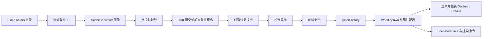
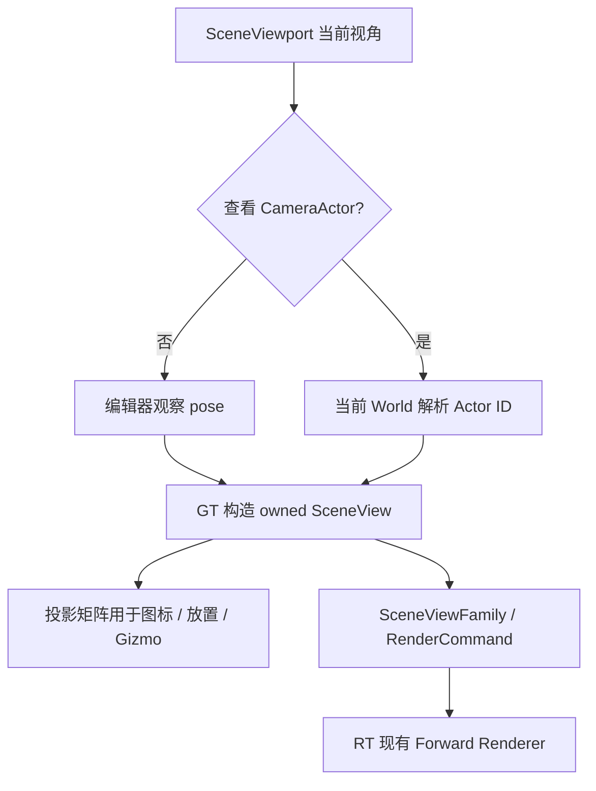

# Toy3d Editor 总体架构（Draft）

## 1. 定位与当前基础

Editor 是使用现有 Engine、GameScene、RenderScene 和资源基础设施的创作程序，不另建一套运行时对象系统。它需要支持场景对象编辑，以及模型、材质、动画、碰撞和场景 Asset 的浏览、预览、修改与保存。各资源类型共享 Asset 身份、索引和文件外层；导入、领域校验、预览和运行时构造分别由对应领域负责。第一条资源贯通链路仍按[编辑器资源接入方案](editor-resource-integration-plan.md)选择静态模型。

当前 `Toy3dEditor` 使用一个原生主窗口承载 ImGui Dockspace；场景渲染到离屏纹理后嵌入 `Scene Viewport`。`EditorApplication` 已组合主菜单、工具栏、状态栏、默认停靠布局、Actor HitProxy 选择与 ImGuizmo 操作。Place Actors 提供内置对象拖放，工厂组合对象，创建、删除、Transform、灯光和相机属性共用撤销历史。`SceneViewport` 持有视口、拾取和 Gizmo 状态，以及独立编辑器观察 pose 和 CameraActor 查看目标；`EditorSelection` 持有场景 Actor 与浏览器 Asset 选择，Outliner、Details 共用该选择。Content Browser 从独立创作 mount 扫描 Asset 外层。启用 Assimp 后，Content Browser 工具栏、空白处右键菜单和外部模型拖入共用导入确认框；保存为 `.asset` 并生成缩略图后，资源图块可拖入 Scene Viewport 创建 Actor，沿同一命令历史撤销重做。生产链遵循 [StaticMesh 设计](static-mesh-import-design.md)。类型化 Asset 编辑、场景文件和 Details 旋转输入尚未接入。本文其余拟新增接口仍是后续设计，不表示已经实现。

近期不建立插件系统、多文档并发编辑、运行时热重载、Blueprint 式对象系统或通用属性方法调用。先完成单个场景编辑视口、单个活动 Asset 编辑会话和可验证的端到端工作流；扩展到多视口、多预览 World 时再扩展相应的渲染输出 contract。

## 2. 所有权与依赖

```text
Toy3dEditor executable（composition root）
├── Engine
│   ├── EditorApplication
│   ├── World、Window
│   └── Renderer / RenderScene / RHI
└── EditorWorkspace（由入口持有，先于 EditorApplication 建立，后于其退出）
    ├── 创作 FileSystem：/Project → project/asset（可写），/Engine → engine/asset（只读）
    ├── /Editor/Resources → engine/editor/resources（只读）
    ├── 冻结的 TypeRegistry、schema migration registry
    ├── 已发布的 AssetIndex
    └── 一个活动的 Asset 编辑会话（后续按资源类型增加）

EditorApplication
├── EditorSelection
├── SceneViewport（相机、尺寸、HitProxy 请求、Gizmo）
├── Editor 命令与撤销边界
├── ActorFactory（内置几何、对象组合与创建描述）
└── ImGui 面板：Place Actors、Outliner、Details、Content Browser
```

`Engine` 继续拥有 World、Window 和渲染框架；`EditorApplication` 通过已有 `Application` 回调使用受生命周期约束的 World/Window observer。可写创作目录、Asset 索引和编辑会话由 executable 的 `EditorWorkspace` 持有并注入 Editor，不能塞入通用 `Engine`、`Application` 或 RenderScene。Engine 的 `/Engine` 与 `/Project` 分别读取 `bin/engine/asset`、`bin/project/asset`，均只读；部署副本不是保存目的地。Editor 与 Engine 使用同一 `Toy3dFileSystem` 实现的不同实例，创作实例统一扫描两个源码资产根后验证身份与强依赖。配置、平台图标和部署规则见 [资源目录设计](resource-directory-design.md)。

依赖方向为 `Editor UI → Editor 工作流 → Resource/GameScene/RenderCore 公共接口`。`Toy3dResource` 不依赖 ImGui、GameScene 或 RenderCore；GameScene 不依赖 Editor。Editor 只通过逻辑视口纹理身份显示 RenderScene 输出，通过 HitProxy 结果取得对象身份，不持有 RHI texture、SceneProxy 或后端句柄。源格式解析器（首期 Assimp）只由 Editor/离线导入目标依赖。

Editor 专用行为使用 `WITH_EDITOR`，导入和重导入所需的创作数据使用 `WITH_EDITORONLY_DATA`。这两个宏不能让共享头文件中同一类型在不同目标里产生不同布局或反射 schema；运行时需要的 Transform、几何引用和材质参数仍保留在运行时 DTO 中。选中态、Gizmo 模式、面板布局和未提交的交互状态不写入 Asset。

## 3. 编辑器状态与面板

| 组成 | 持有状态与职责 | 不承担的职责 |
| --- | --- | --- |
| `EditorApplication` | 调度启动、关闭和每帧回调；组合工作区、视口和面板 | 资源格式解析、每个面板的长期状态细节 |
| `EditorSelection` | 集中管理场景 Actor 选择、浏览器 Asset 选择及当前 Details 焦点 | 持有 Actor 裸指针、决定磁盘保存 |
| `SceneViewport` | 编辑相机、图像区域、物理像素尺寸、视口 generation、HitProxy 请求及结果匹配、Gizmo | 资源索引和 Asset 保存 |
| `Outliner` | 从 World 枚举 Actor，显示层级并发出选择操作 | 独立保存选中 ID 或修改渲染代理 |
| `Details` | 按当前选择显示 Actor 属性或 Asset 属性；发起受控修改 | 绕过 setter、`EditSession<T>` 或领域校验直接改数据 |
| `Content Browser` | 默认浏览 `/Project`，可开启只读引擎资产显示；从 AssetIndex 展示目录、类型和 Asset | 用文件名推导身份、编辑部署副本 |
| `EditorWorkspace` | 创作 mount、索引发布、类型化打开/保存、活动 Asset 会话 | ImGui 绘制、运行时 World 生命周期 |

首期默认布局：中央 `Scene Viewport`，右上 `Outliner`，右下 `Details`，底部 `Content Browser`；主菜单、全局工具栏和状态栏位于停靠区域外。面板可停靠，布局保存到 `bin/saved/editor_layout.ini`；用户保存的布局优先于默认布局，可通过 `Window > Reset Layout` 恢复。现有编辑视口已改称 `Scene Viewport`；未来运行游戏的 Game Viewport 是不同用途的面板，不复用编辑相机和 Gizmo 状态。

选择以值身份表示。Actor ID 只在当前 World 生命周期内有效，取用前重新查询存活；Asset ID 在文件移动后仍保持稳定。场景 Actor 选择与浏览器 Asset 选择分别保留，最后一次主动选择决定 Details 当前显示哪个目标；在浏览器选中 Asset 不会抹去视口中的 Actor 选择。切换 World、关闭资源、删除对象或收到过期 HitProxy 结果时，对应选择必须失效或重新解析。Outliner、视口和 Content Browser 都写入集中管理的选择状态，Details 只读取它。

ImGui 面板每帧即时绘制，但工作区、选择、活动会话、撤销历史和视口相机跨帧存在。首期不为每个 ImGui 窗口创建一个长期通用 `EditorDocument` 基类；模型等 Asset 使用其领域类型与 `EditSession<T>`，场景文档要等 World 装配/保存 contract 明确后设计。

## 4. 输入、修改与撤销

输入优先级为：模态对话框及文本输入 → 正在拖动的 Gizmo → 视口点击 HitProxy → 编辑器快捷键 → 游戏输入。只有鼠标位于实际场景图像区域，且更高优先级操作未消费点击时，才提交 HitProxy 请求。结果返回后校验请求 ID、视口 generation、场景 generation 和对象存活；较晚返回的结果不得覆盖较新的选择。

面板仅通过标题栏或停靠 tab 移动（`ConfigWindowsMoveFromTitleBarOnly`）。资源拖动期间禁止 Gizmo 和拾取，Scene Viewport 只在 delivery 返回 owned AssetPlacementRequest；Editor 在绘制后通过 AssetId 重新解析资源并提交创建命令。导入确认框打开时屏蔽删除、撤销/重做快捷键，新外部文件批次不替换当前设置。

所有 Editor 状态和 World/Asset 修改在 Game Thread 的受控提交点执行。Actor Transform 必须走 `SceneComponent::set_local_transform()` 等领域 setter，不能直接改内部数据；一次 Gizmo 按下至松开构成一个撤销事务，Details 的一次数值提交也构成一个事务。Actor 命令记录修改前后值和对象身份，撤销/重做时重新解析对象，并在对象已删除或 World 已切换时明确失败或失效。不要把这些 World 命令伪装成 `EditSession<T>` 的 Asset 补丁。

Asset 属性修改使用 `TypeRegistry`、`PropertyPath`、领域 validator 和已有 `EditSession<T>` 的事务、撤销及保存语义。Editor 负责把失败返回值写入现有 Logger，需用户处理时显示 Dialog；底层不创建第二套诊断系统。保存成功才清除脏状态。切换或关闭脏会话时由 Editor 提供保存、放弃或取消选择；文件冲突、未知段不能无损保留或 blob 版本不一致时保持旧文件与脏会话。

```cpp
// 拟新增的 Editor 层语义，不是现有函数签名。
selection.select_actor(world_id, actor_id); // 视口和 Outliner 共用场景选择入口
selection.select_asset(asset_id);            // 保留场景选择，切换 Details 焦点

if (auto* actor = selection.resolve_actor(world)) {
    Transform before = actor->root_component()->local_transform();
    Transform after = edited_transform;
    actor_commands.apply_transform(actor->actor_id(), before, after);
    // 命令内部调用 SceneComponent setter；拖动结束后合并为一次撤销。
}

auto& session = workspace.open_asset<ModelAssetData>(asset_id);
session.apply_edit({EditPatch{property_path, encoded_value, EditChangeKind::Setter}});
workspace.save_active_asset(); // 先验证、再原子保存；失败保留脏会话。
```

上面两个选择调用表达同一选择服务的两种目标，具体 API 需在实现时根据 World 身份和 Details 焦点需求收敛；`open_asset`、命令对象及保存入口均为设计草案。UI 不得把伪代码中的返回状态省略，实际调用必须检查失败并呈现原因。

## 5. 场景、资源与预览边界

当前 Engine 持有主 World，Editor 另持有独立缩略图预览 World，Renderer 显式拥有主/预览 RenderScene 与各自 targets。Application 通过 `starts_world_play()` 声明启动策略：普通应用默认 Playing，Editor 主 World 仅 initialize 并绑定 SceneInterface，不执行 BeginPlay 或 Gameplay Tick。正式场景 Asset 装配前仍需定义候选装配与切换/销毁顺序；Play 模式另行设计。场景保存使用持久 Actor/Component 身份，不能写入临时 HitProxy/Actor ID。

保持一个 Scene Viewport；StaticMesh 缩略图通过独立预览 World 和离屏输出生成，不替换场景视口。图片使用动态逻辑纹理 ID，面板不持有 RHI texture；复用现有 Forward/Tonemap 和单 graphics context。池、GPU 寿命和包内 PNG 规范见 [Asset 缩略图](asset-thumbnail-design.md)。完整模型/材质编辑视口的相机交互与更多预览场景仍需按实际用例扩展。

模型、动画、碰撞、场景共享 Asset 外层和 Content Browser，但不共享一个万能预览器。模型从几何 blob 构造 `StaticMesh`；材质属性以 Shader `Properties` 为权威；动画需要轨道/时间线与目标验证；碰撞需要形状/物理后端适配；场景需要 World 候选装配。领域尚未就绪时，浏览器仍可显示 Asset 外层信息，Details 可只读展示可用元数据，并明确报告不能预览或编辑的原因。

## 6. 建议的落地目录与目标

```text
engine/editor/
├── CMakeLists.txt
└── source/
    ├── main.cpp                      executable composition root
    ├── editor.h/.cpp                 Application 适配与调度
    ├── workspace/                    创作目录、索引、活动 Asset 会话
    ├── selection/                    统一选择身份与存活解析
    ├── commands/                     EditorCommandHistory：创建、删除与属性撤销
    ├── placement/                    目录、ActorFactory、放置位置策略
    ├── viewport/                     Scene Viewport、相机、HitProxy、Gizmo
    └── panels/                       Place Actors、Outliner、Details、Content Browser
```

目录随实际类型逐步创建，不预建空类。初期继续使用 `Toy3dEditor` 目标；若无界面资源工作流需要被独立工具复用，应把领域能力放入对应 resource/domain 目标，而非让工具依赖 Editor。当前 Editor CMake 已显式登记新增子目录中的源码，后续继续按仓库 CMake 规范登记。ImGuizmo 仅链接 Editor 目标。

## 7. 分批交付与验收

1. **编辑器交互骨架**：已提取 Actor Selection 与 Scene Viewport，增加 Outliner、位置/缩放 Details 和 Transform 撤销/重做。仍需补全 Details 旋转编辑及实际窗口交互验收：视口/列表双向选中、点击背景、对象销毁、窗口 resize、Gizmo 输入优先级和旋转/缩放。
2. **Asset workspace 与浏览器**：Editor 入口持有独立创作 FileSystem，项目源目录默认 `project/asset`，`--Editor.AssetRoot=<path>` 可指定；与部署根、引擎资产或界面资源重叠则拒绝初始化。资源层统一扫描项目与引擎 `.asset` 外层，验证 ID 与跨根强依赖，成功后一次发布，失败保留旧索引；Content Browser 默认 `/Project`，通过 `Show Engine Content` 显示只读引擎目录。仍需生产 Asset 创建/ID 生成、可写权限验证、类型注册及资源打开；路径移动和重启后的身份稳定需用生产文件验收。不得编辑部署副本。
3. **模型生产与资源 Details**：受控网格和真实 FBX 进入同一模型 Asset；类型化打开、预览、编辑、撤销、保存与重开。验证导入失败保留旧预览、blob 保存冲突、未知段只读和脏会话切换。
4. **场景文档**：Editor World 已隔离 Gameplay 生命周期；补候选装配，再实现持久场景 Actor/Component ID、层级、保存和重新打开；Play 模式另行设计。
5. **后续领域与多视口**：材质、动画、碰撞的专用编辑和预览；出现同时显示多个预览的实际用例后扩展渲染输出。

每批只引入该批需要的类型和接口。实现改动按受影响模块配置、构建和测试；UI/渲染行为用实际窗口验收。本文是 Editor 总体边界，资源格式和编辑会话的规范仍以[编辑器资源基础设计](editor-resource-foundation-design.md)为准，World 生命周期以[GameScene 设计](gamescene-design.md)和[Application 设计](application-design.md)为准。

## 8. Place Actors 与放置链路

Place Actors 位于默认布局左侧，提供内置对象目录；Content Browser 浏览用户磁盘 Asset。目录由 Editor 显式登记，搜索过滤同一份目录，不依赖运行时反射枚举。当前条目为 Empty Actor、Camera、Cube、Plane、Directional Light、Point Light。Sphere、Cylinder、Cone、Spot Light 后续加入。

| 文件/类型 | 职责 |
| --- | --- |
| placement_catalog | 条目、类别、默认地面偏移和拖放值身份 |
| ActorFactory | 组合 Actor/Component，持有几何原型和共享材质，记录创建类型 |
| actor_placement | 视口坐标反投影、地面相交和备用距离 |
| SceneViewport | 仅实际图像接受拖放；提示候选位置，松开后提交命令 |
| EditorCommandHistory | 创建、删除、Transform、灯光和相机属性共用一条撤销历史 |



payload 仅包含 PlacementItemId，不保存对象或面板指针。拖动取消不修改 World。按引擎 0..1 reversed-Z 约定反投影；与 Y=0 相交且距离在 (0,100] 米时使用交点，Cube 抬高半高度。近平行、交点在后方或过远时使用鼠标射线前方 8 米。图像外坐标或无效矩阵拒绝放置。当前提示为位置环和名称，不生成临时 Actor；完整候选网格、地表和栅格吸附后续加入。

```cpp
PlacementRequest request;
request.item = PlacementItemId::Cube;
if (calculate_placement_transform(view, projection, camera_position,
                                  image_position, item, request.transform)) {
    const auto actor_id = command_history.place_actor(world, request);
    if (actor_id != 0) {
        selection.select_actor(world, actor_id);
        scene_viewport.cancel_pending_hit();
    }
}
```

创建和删除保存工厂类型与属性值。重做创建或撤销删除获得新的临时 Actor ID，并同步重映射两条历史栈中的相关记录。失败保留历史和 redo，不遗留候选对象。当前仅支持工厂创建对象的删除重建，不能快照任意游戏 Actor、attachment 或全部 Component。切换场景必须清空历史；持久场景 ID 留给场景资源。

工厂仅编译到 Editor。灯光标记由 SceneViewport 投影 root world position，再通过 ImGui 绘制固定 36 个逻辑像素的图标：方向光为太阳，点光为灯泡；Place Actors 复用同一绘制函数。标记保持朝向屏幕，不受 Actor rotation、scale、距离或场景光照影响，选中与悬停有高亮。图标不创建 Runtime Component 或渲染资源，数据和绘制仅存在于 Editor target；GPU 继续使用现有 ImGui draw data 提交链路。

选中的方向光额外显示金色光线方向箭头。方向与实际光照一致，来自 root world rotation 变换本地 +Z，表示光从灯光朝场景行进；使用 world rotation 而非带 scale 的矩阵列，避免非均匀缩放扭曲方向。将 2 米方向线先裁剪到齐次视锥再投影，屏幕长度限制为 80～160 个逻辑像素以保持可读，箭头不参与选取。投影几乎退化为一点时，用圆点表示光线朝向镜头、叉号表示背离镜头，并显示文字。方向提示随 Gizmo、属性和撤销重做的实际 Transform 更新，仍裁剪在视口图像内。

首期图标作为编辑器覆盖层显示，未读取场景深度，因此可透过场景几何看到和选中灯光。视锥外、相机后和近远裁剪面外不显示；绘制裁剪到实际视口图像。重叠图标按 reversed-Z 深度绘制和命中最近项，同深度按 World 顺序确定。图标点击检查其屏幕矩形、选择所属 Actor 并取消旧异步拾取结果；Gizmo 和拖放输入优先。模型仍通过 GPU HitProxy Pass 选取。将来需要遮挡和 Component 级图标选取时，再接入渲染器 sprite 与 HitProxy，不能把覆盖层命中当作场景几何命中。

Cube/Plane 每次从原型创建独立 StaticMesh，共享材质，避免重做复用已经 Released 的上传缓冲。生产模型的多对象共享与重新注册由正式资源生命周期负责。

StaticMeshComponent 在 Remove 后追加 FIFO 引用释放命令，保留旧网格和材质 override 到代理摘除完成。Editor shutdown 先清历史并销毁 Actor，再 flush，排空后释放工厂原型与共享材质。引用保留不代替 MaterialInstance 最后引用的显式 release contract。

## 9. 首期灯光能力

DirectionalLightActor、PointLightActor 仅组合对应 LightComponent root。组件注册、变换和属性 setter 经 SceneInterface 的 add_light、update_light、remove_light 投递 owned data。RenderScene 独占 LightSceneProxy，不保存 GameScene 指针。World bind/unbind 对已注册灯光追平并清理 render state。

Forward Base Pass 通过生成的 Pass 参数消费场景灯光；方向光不再是 Phong Material 属性。首期支持一盏方向光和四盏点光，按 render_priority 降序、同优先级注册顺序选择，超出上限时按状态变化记录 warning。点光采用半径内平方衰减，不提供阴影或物理单位曝光模型；Spot Light 明确记录未支持。两组 Float4x4 的列分别保存点光位置/半径和颜色强度，沿现有矩阵 ABI 编码，无 descriptor array 或公共 RHI 改动。Vulkan ES3.1、D3D11 SM5、D3D12 SM6 都可用常量缓冲实现，当前验证平台为 Windows Vulkan。

Details 支持灯光启用、线性颜色、强度和半径，连续修改合并为一次撤销。方向使用 root rotation 和 Gizmo；光线行进方向为本地 +Z 的世界旋转结果，着色时取负得到指向光源的方向。

## 10. 首期场景相机

Place Actors 的 Basic 类别提供 Camera，默认放置高度为地面上 1.5 米、朝向为本地 +Z。ActorFactory 创建 Runtime CameraActor；Outliner 和现有 Actor 选择共享该身份。Details 编辑垂直 FOV、近远裁剪面，连续输入共用 EditorCommandHistory；创建、删除及重建也记录相机参数。非法投影先校验再修改 Transform，失败保留原状态并记录日志。当前仍通过 Gizmo 旋转相机，Details 没有新增欧拉角输入。

`SceneViewport` 保存独立的编辑器观察 pose 和场景相机查看目标。查看目标使用 World observer 与 World-local Actor ID，每次访问都从当前 World 解析；observer 仅比较身份，不通过它读取旧 World。进入或退出查看递增 viewport generation 并取消旧异步 HitProxy 请求。当前 EditorApplication 和 Engine 的单 World 生命周期保证 observer 的有效区间；未来替换 World 时必须先退出查看，不能仅依赖地址比较识别重建后的 World。

选中相机不会自动切换画面。Details 的 `View Camera` 显式进入查看，Details 或视口顶部的 `Exit Camera View` 恢复原观察 pose。查看目标与 Actor 选择独立；查看期间暂停视口拖放、Gizmo、图标和图像选取，Outliner/Details 继续工作。删除或无效化目标后使用观察 pose；撤销删除产生新 Actor ID，必须显式重新进入查看。查看只读取相机，不把视口输入写回对象，不表示 Gameplay 已选定活动相机。

`current_view()` 是当前视角的唯一数据来源，视口图标、Gizmo、放置从它构造矩阵，渲染提交复制对应 SceneView。Details 在 SceneViewport 绘制前执行，让相机参数和视角切换在本帧生效。画面宽高比使用物理输出尺寸；没有固定宽高比、黑边、正交或摄影机物理参数。

`viewport/actor_icons.*` 统一灯光和相机的 Editor 覆盖层。相机使用固定 36 个逻辑像素的摄像机图标，Place Actors 使用 24 像素版本。灯光与相机在同一份列表按 reversed-Z 深度排序，命中最近图标；不读取场景深度，仍可透过几何显示与选取。选中相机额外绘制长度 3 米的 FOV 示意锥及 +Z 提示，使用 world rotation，忽略 scale。此图形不是实际 near/far 裁剪范围；每条线段先裁剪到观察者齐次视锥，再投影到 ImGui 图像，端点在镜头后方时不会发生翻转或无界坐标。图标原点被裁剪时，仍绘制可见的示意锥线段。

相机图标和示意锥只编译在 Editor target，不增加 Runtime 渲染组件、公共 RHI 接口或新 Pass；以后若 Runtime 类型增加编辑器行为/数据，继续分别使用 WITH_EDITOR/WITH_EDITORONLY_DATA 隔离。画中画需要独立离屏输出与逻辑纹理生命周期，Pilot 需要导航输入和写回 Transform 的撤销合并，场景保存需要持久 Actor/Component 身份；这三项留待对应模块接入，不把本轮撤销记录当作场景 Asset 序列化。


