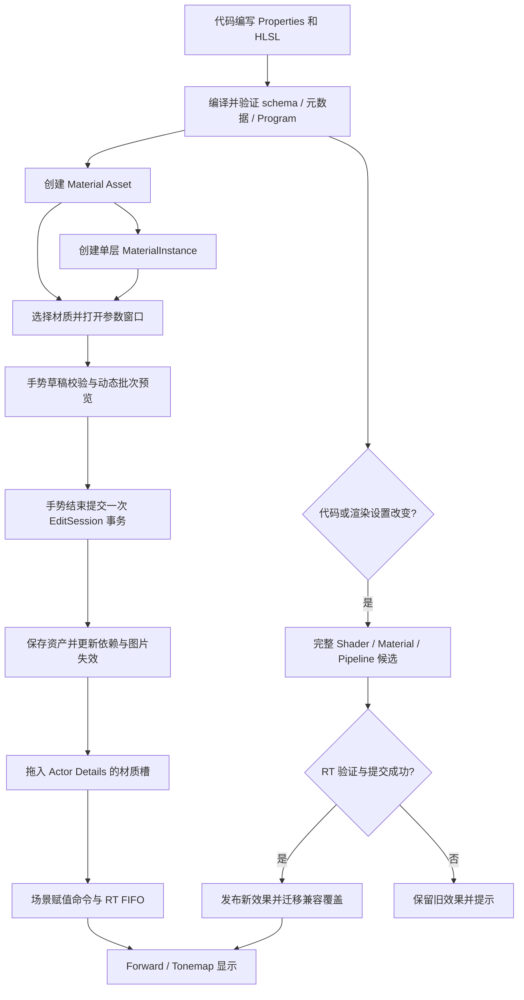

# 代码材质与参数化编辑设计

## 1. 状态与已确认范围

本文是材质资产和 Editor 参数化工作流的 Active 设计。产品范围已确认，新增类型、函数和执行清单是后续实施要求，不表示当前代码已经支持。Shader 语法、参数身份及 GPU 布局继续遵循 [Shader 系统](shader-system-design.md)，文件与编辑事务遵循 [资源基础](editor-resource-foundation-design.md)，GT/RT 更新遵循 [Material updates](../openspec/specs/game-render-framework/material-updates/spec.md)。

当前已落地 M1 的属性格式、编译器输出、默认值解码和 Unlit 颜色消费，M2 的 Material/单层 Instance DTO、编解码、创建框和运行时构建，以及 M3 的参数窗口、EditSession、手势、批次、重置、保存和脏关闭流程。当前仅开放可完整加载的 Phong；材质槽赋值在 M4，Sampler 与 UV 采样在 M5，可见材质预览与已加载引用者传播在 M6，不提前开放包含未支持 Sampler 的 Unlit。

首版完成以下能力：

- 使用 `.shader` 的 `Properties` 声明参数，用 HLSL 编写材质效果；源码在外部编辑器中修改，Editor 提供打开源码和手动重新编译。
- 完善 Phong 和 Unlit；支持 Opaque 和根材质的双面设置。
- 支持 Base Color Texture2D、PNG/JPEG 导入、UV 缩放和 Sampler preset。
- Material 和单层 MaterialInstance 均为可保存的 `.asset`，参数面板自动生成。
- 支持实时预览、恢复默认、一次手势一次撤销、原子保存及未保存提示。
- 支持材质图块拖入 Actor Details 的明确材质槽、赋值撤销和恢复网格默认材质。
- 编辑材质资产时同步更新当前已加载的引用者；只修改一个对象时显式创建独立动态实例。
- 编译、加载或结构性替换失败保留旧效果；错误通过现有 Logger 和 Editor 提示呈现。

PBR、Normal Map、tangent 生成、透明排序、Masked、静态开关面板、多层实例继承、材质节点图、内置源码编辑器、自动文件监听及完整 Cook 不属于首版。语言能够声明某个参数类型不代表运行时材质已经支持它；首版面板仅开放 Float、Float2/3/4、Color、Range、Texture2D 和普通 Sampler，其余类型明确提示不支持。

## 2. 现有实现与迁移起点

| 当前入口 | 可以复用 | 需要补齐 |
| --- | --- | --- |
| `rendercore/material/material.*` | Material、MaterialInstance、资产构建、schema 默认值、按名 setter、批次、reset 和 replacement | Sampler、已加载资产引用者传播 |
| `renderscene/material/material_render_proxy.*` | RT 独占状态、persistent Material binding 和按需物化 | 普通 Sampler、经校验的参数批次及完整 schema replacement |
| `shader/format/shader_format_types.h`、`shader_editor_properties.h` | 完整参数 schema、稳定 ID、布局、默认值、可选属性描述及摘要校验 | Editor 自动控件接入 |
| `shader_compiler/frontend/shader_ast.h` | Properties 显示名称、Color、Range、源码位置，已输出独立属性文件 | Editor 使用编译产物，不依赖 AST |
| `panels/scene_panels.cpp` | Actor Details 与选择路由 | 当前 Asset Details 仅显示外层信息，需正式材质打开与编辑 |
| `StaticMeshComponent` | 按材质槽赋 override | 清除 override、Editor 资产引用和命令历史 |
| `thumbnails/`、`ui/ui_texture_work.h` | 独立预览 World、逻辑纹理、多图和颜色读回 | 材质预览、交互与缩略图调度、显示预览免读回路径 |

当前 ActorFactory 从 schema 填充数值默认值，显式提供内置白纹理；内置对象共用同一 MaterialInstance。不能用修改该实例的方式实现单对象参数编辑。Phong 和 Unlit 当前使用 `Texture.Load(0,0)`，Unlit 已消费 base_color；贴图的 UV 与显式 Sampler 采样仍待 M5。Unlit schema 声明的 Sampler 尚未被运行时材质支持，不能因 Shader 编译成功就向用户开放该材质的完整加载/编辑。StaticMesh 已有 UV0，但没有 tangent，因此不能宣称已支持 Normal Map。

迁移以保持已有模型可绘制为前提：先建立 schema 驱动的构建入口并覆盖默认值，再迁移 ActorFactory，最后删除手工列举 Shader 参数默认值的创建路径。GT 到 RT 的 FIFO、最终 release 和 GPU completion 保活协议继续使用现有实现。

## 3. 目录、目标与依赖

| 位置 | 目标与职责 |
| --- | --- |
| `engine/core/material/` | `Toy3dMaterialAsset`：Material/Instance DTO、覆盖记录、验证、引用与编解码 |
| `engine/core/texture_asset/` | 拟新增 `Toy3dTextureAsset`：Texture2D 元数据、mip payload、引用和格式验证 |
| `engine/core/image_codec/` | 扩展现有 `Toy3dImageCodec`：有界 JPEG 解码；PNG 原接口和缩略图限制保持有效 |
| `engine/shader/format/` | 扩展 `Toy3dShaderFormat`：只读属性描述格式、hash 与读取校验 |
| `engine/tools/shader_compiler/` | Properties 元数据生成、项目源码编译和依赖验证 |
| `engine/tools/texture_import/` | 拟新增 `Toy3dTextureImport`：源图像转 Texture2D Asset 的纯 CPU 生产链 |
| `engine/runtime/rendercore/material/` | 从领域 DTO 构建 Material/MaterialInstance、参数及候选发布 |
| `engine/runtime/rendercore/texture/` | 从 Texture2D Asset 构建现有 Texture，不在 runtime 解码 PNG/JPEG |
| `engine/editor/source/material/` | 参数手势、预览、引用者更新及编译结果接管 |
| `engine/editor/source/asset_tools/` | 资产创建/导入与项目发布策略 |
| `engine/editor/source/panels/material_editor_panel.*` | 材质窗口与自动参数控件 |

`Toy3dMaterialAsset` 依赖 Resource、Math 和 ShaderFormat 的数据 contract；ShaderFormat 不依赖材质资产。TextureAsset 依赖 Resource 和 PixelFormat，不依赖 RHI 或图像解码。TextureImport 依赖 TextureAsset、ImageCodec、Hash 和 FileSystem，不依赖 runtime/editor。Editor 组合领域数据、导入器和 RenderCore。所有目标使用 C++17、显式 source 清单和 target 级依赖，不修改第三方源码。

游戏材质和纹理保存在 `project/asset/<用户选择的目录>/*.asset`，引擎内容保存在 `engine/asset/`。不强制 `materials`、`textures` 等子目录，也不建立 `runtime/resource` 或通用 AssetDocument。

项目手写 Shader 源码采用独立的 `project/shader/`，对应 `/Project/Shaders/`；共享 include 采用 `project/shader/include/`，对应 `/Project/ShaderIncludes/`。引擎已有 `engine/shader/builtin`、`engine/shader/include` 保持原职责。项目 Shader 接入前只开放已登记的引擎 Shader；不能让 UI 选择尚不能编译或加载的项目源码。配置、源码、生成产物和 `.asset` 分别管理，详见 [目录设计](resource-directory-design.md)。

## 4. 数据模型、身份与保存

### 4.1 三层材质

| 层 | 身份与内容 |
| --- | --- |
| Shader | 现有逻辑名，如 `Project/Surface/Painted`；Properties、HLSL、Pass、Variant 定义 |
| MaterialAssetData | Asset ID 位于通用外层；保存 Shader 逻辑名、动态参数覆盖与根材质双面设置 |
| MaterialInstanceAssetData | 外层 Asset ID；保存强类型父 Material 引用和动态参数覆盖 |

Instance 的 parent 必须为 MaterialAssetData，不得为另一 Instance。首版实例继承父材质 Shader、Pass 和双面设置，只覆盖动态参数。默认使用 `Forward` 和现有默认 permutation；不在资产中持久化平台、native slot 或编译缓存目录。

有效参数值按 `实例覆盖 → 根材质覆盖 → Shader 默认值` 解析。根材质参数面板的恢复默认移除根覆盖；实例取消覆盖移除实例记录。不能把继承值复制保存成覆盖，否则父材质变化后无法继续继承。贴图选择器清空表示移除该层覆盖，继承失败时按 Shader 的具名内置默认贴图解析；不能向现有 set_texture 传空 TextureRef。

以下为拟新增 C++17 DTO 伪代码，正式头文件须显式登记所有反射类型和字段；所有声明遵循现有生成器受限语法：

```cpp
struct MaterialParameterOverride
{
    std::string name; // Shader canonical name，也是集合元素的稳定身份。
    // C++17 variant 表达封闭的材质参数值集合，避免无类型字节或冗余 kind/value。
    std::variant<float, Vector2, Vector3, Vector4,
                 AssetRef, MaterialSamplerPreset> value = 0.0f;
};

struct MaterialAssetData
{
    std::string shader_name;
    std::vector<MaterialParameterOverride> overrides;
    bool two_sided = false;
};

struct MaterialInstanceAssetData
{
    AssetRef parent; // expected_type = toy3d.MaterialAssetData，Strong。
    std::vector<MaterialParameterOverride> overrides;
};
```

`MaterialSamplerPreset` 是领域稳定枚举，保存具名 preset，与 Shader 声明共享唯一的 preset 表；不能持久化 RHISamplerDesc。实现前先盘点 Shader 现有声明，若已有同义类型直接复用。Vector4 的 Color 语义来自 Shader 属性描述，资产无需另一套 Color/Vector 类型。Properties 默认值只保存在 Shader schema，材质不复制整份 schema、GPU padding 或 UI 元数据。

参数在编解码前按 canonical name 确定性排序，拒绝同名重复覆盖。Parameter ID 按 Shader 已有算法解析，类型不进入 ID，因此每次应用仍校验类型；ID 不作为业务调用方传入 RT 的公开参数。名称变更是删除/新增，不按列表下标或 native slot 匹配。

根材质和实例注册为两个正式领域类型，使用现有反射与生成的值编解码。依赖索引保存 parent 和 Texture2D Asset 引用，Shader 逻辑名由 Shader 查询边界验证，不伪造不存在的 Shader AssetRef。新增、保存和运行时解析时，领域 validator 遍历全部覆盖记录检查引用，不能只依赖 EditSession 对单个 AssetRef 补丁的校验；整体数组补丁同样要完整验证。

### 4.2 Orphan 与兼容性

已有覆盖遇到参数删除或类型变化时，保留原始名称和值，标记为 orphan，面板显示原因，渲染使用新 schema 中合法的覆盖和默认值。Orphan 状态由当前 schema 计算，不写入第二份持久化数组；普通面板不得新建未知参数覆盖。重新切回兼容 Shader 时可重新解析，显式删除 orphan 可以撤销。

已知、可无损解码的 orphan 允许原样保存。未知必需类型/variant 分支失败；未知可选 typed 字段无法无损保留时按资源基础只读打开并禁止保存。orphan 中可识别的 AssetRef 仍进入依赖索引；缺失引用显示未就绪并阻止新增非法引用，不能偷偷删掉依赖以通过校验。

材质类型数据写入通用 `type_data`，缩略图为已有可选段。创建使用新 ID、catalog 查重和 CreateNew；保存使用 EditSession、原子 Replace，并保留原文件全部可选段。依赖变化必须更新索引；不得保存旧依赖列表。写前检查当前 type_data、身份和引用索引；缩略图单独更新允许重新读取最新原始段并保留，不能拿打开时的旧 PNG 覆盖新生成图片。冲突保留文件、脏会话和可用预览。

## 5. Shader 属性视图与自动面板

Properties 是唯一参数权威；C++ 反射只描述覆盖记录和材质外层。Editor 不重复解析 HLSL、不从编译后 active binding 反推可编辑参数；未被某个 variant 使用的 Properties 仍显示，必要时提示当前未使用。

需要输出只读的 `ShaderEditorProperty` 描述：canonical name、parameter ID、显示名称、控件语义（Color 与 Float4 区分）、range bounds、源码显示顺序。参数类型、默认值和布局仍来自完整 ShaderParameterSchema。首版不为 Category/Tooltip 等新注解扩展语言，只使用现有 Properties 信息。

UI 描述作为独立可选编译产物，具有版本、所属 Shader 和完整 schema identity。生成器与 reader 同时检查唯一名称/ID、类型兼容、有限 range、边界顺序、引用成员存在、UTF-8、记录容量和内容签名。缺失 UI 描述可以按 canonical name 和类型显示普通控件；损坏或不匹配的描述显示错误并忽略，不能影响已验证的 GPU 布局。

现有实现入口为 `format/shader_editor_properties.h`：`ShaderEditorProperty` 提供 Numeric/Color/Range/Resource 控件语义、显示顺序与可选单边范围；参数类型仍从完整 schema 查询。`editor_properties.txt` 使用版本 1、所属 Shader、完整 schema identity 和内容摘要；最多 4096 条、每个文本最多 1024 字节、文件最多 1 MiB。读取失败不替换输出，缺失文件成功返回空视图供调用方回退。默认 ShaderMap reader 不读取此文件，Editor 在已验证 entry 的目录上显式调用 `read_shader_editor_properties()`，并使用完整 Program schema 校验，而非抽取后的 Material-only schema。

`TOY3D_SHADER_EDITORONLY_DATA` 默认 ON，控制目标内 `WITH_EDITORONLY_DATA`，用于工具生成和可选文件加载；关闭后不生成属性文件，读取入口明确返回不支持。字段和摘要仍保留在公共数据类型中。schema/generated parameters 版本已升级到 2，ShaderMapEntry 到 6；旧产物拒绝并要求重新生成，不影响 `.asset` 外层版本。源码顺序仅决定显示顺序，GPU 常量偏移继续使用当前 compiler 的 ID 确定性排序；调整源码顺序会改变 UI 摘要，不改变既有 packing。

UI 描述内容 hash 参与完整 schema identity，但不参与 logical layout、native mapping、字节码或 PSO 布局身份。摘要保留在稳定公共 schema 中，Shipping 可移除显示文本而仍验证默认值和完整身份。Material group 抽取、generated C++、schema reader/writer/hash 计算必须一起迁移；不能只更新 Editor 单边猜测 hash。格式变更要升级实际受影响的生成/持久化版本，重建既有可再生成的 ShaderMapEntry，不维护永久双轨 reader，不改 `.asset` 通用外层版本。

Editor 行为使用 `WITH_EDITOR`，UI 描述生成/加载使用 `WITH_EDITORONLY_DATA` 隔离。采用独立可选数据及入口，不以条件字段改变公共 DTO、ShaderParameterSchema、MaterialDesc 的 C++ 布局或反射 schema。Shipping 默认值、类型、参数身份和布局均保留。

控件规则：Float 使用 DragFloat，Range 使用有界滑块，Float2/3/4 使用对应数值控件，Color 使用颜色控件，Texture2D 使用有类型过滤的资产选择/拖放，Sampler 使用 preset 下拉。浮点必须有限；Range 是编辑提示，领域 validator 仍单独决定合法值，首版面板限制提交到声明范围，不能把 UI clamp 当作 runtime 类型校验。Color 值在线性空间保存，UI 的 sRGB 显示转换显式执行，alpha 不做 gamma 转换。

下面是首版完成后的代码使用示例，沿用现有语法，Unlit 中颜色、贴图和 UV 缩放都有实际消费者。代码保存后通过 Editor 手动重新编译，材质窗口自动显示四个 Properties；Phong 使用相同的参数入口组合现有灯光计算。

```hlsl
Shader "Project/Surface/Painted"
{
    Version 1
    Properties
    {
        base_color ("Base Color", Color) = (1, 1, 1, 1)
        base_color_texture ("Base Color Texture", Texture2D) = "white"
        uv_scale ("UV Scale", Float2) = (1, 1)
        material_sampler ("Material Sampler", Sampler) = TrilinearWrap
    }
    Pass "Forward"
    {
        HLSLPROGRAM
        #pragma vertex vs_main
        #pragma pixel ps_main
        struct VSInput
        {
            float3 position : POSITION0;
            float2 uv : TEXCOORD0;
        };
        struct VSOutput
        {
            float4 position : SV_Position;
            float2 uv : TEXCOORD0;
        };
        VSOutput vs_main(VSInput input)
        {
            VSOutput output;
            output.position = mul(toy_view_projection,
                mul(toy_object_to_world, float4(input.position, 1)));
            output.uv = input.uv;
            return output;
        }
        float4 ps_main(VSOutput input) : SV_Target0
        {
            return base_color * base_color_texture.Sample(
                material_sampler, input.uv * uv_scale);
        }
        ENDHLSL
    }
}
```

## 6. 运行时构建与参数 API

M1 已实现 `initialize_material_constant_defaults(MaterialDesc&, std::string& error)`：从完整 Material-only schema 的 little-endian binary32 默认字节填充 Float/Float2/3/4 默认值，包含 inactive 参数；拒绝数组、矩阵、缺失和非有限值，失败不修改任何现有默认值。资源默认值仍由创建方解析，Sampler 在 M5 接入。ActorFactory 已调用该入口，删除了手写数值默认清单，内置 Phong 数值沿用 `.shader Properties`。

M3 已提供 `MaterialParameterChanges`：每条记录按名称提交 float、Core Vector2/3/4、TextureRef 或表示重置的 monostate。`validate_parameters()` 预检整个批次，`apply_parameters()` 在一个 owned RenderCommand 中发布已解析 ID 与值；现有 scalar/vector/texture setter 与资产构建共享此入口，拒绝重复名称、未知参数、类型不符、非有限数值和空纹理。`reset_parameter()` 移除 GT 覆盖并向 RT 发送 Shader default。同一 Proxy 保持地址稳定，不创建 RHI 对象或 flush。Texture 先由 GT 新快照和命令强引用保活，旧引用在整批 RT 更新后释放；命令准入异常恢复 GT 纹理快照，框架准入仍要求活动 facade 和 owner GT。该 CPU/FIFO 层不改变 Vulkan、D3D11 FL11_0/SM5、D3D12 或移动 Vulkan ES3.1 的 binding 映射。

M2 的正式运行时入口为 `rendercore/material/material_asset_builder.h`：`create_material_from_asset()` 与 `create_material_instance_from_asset()`。`MaterialTextureValues::named_defaults` 提供 Shader 具名默认纹理，`assets` 提供已按 Asset ID 解析的强纹理引用。构建先验证整份领域数据和资源，再按根/子优先级以 M3 的单批次 API 应用合法覆盖；已知 orphan 不应用但仍保留在 DTO 中。调用方必须是已启动 RenderCommand facade 的 GT owner，沿用既有 setter 的框架错误和 FIFO contract。返回的 AssetResult 持有候选强引用，最终释放前先结束结果对象及其他用户的引用，再调用 `MaterialInstance::release()`；不在构建器里新增全局加载缓存。ActorFactory 已迁移到此入口。父配置实时传播在 M6 接入。

运行时加载由 GT/应用资源 owner 发起，先取得 ShaderMapProgram、领域数据和 TextureRef，再构建 Material/Instance。不可变 runtime Material 保存 Shader schema/default 和根材质结构性设置；Material Asset 的动态覆盖应用到该资产对应的 runtime MaterialInstance。派生 Instance 共享同一个 runtime Material，并在其 runtime MaterialInstance 中组合根覆盖和自身覆盖。不能把经常编辑的根动态配置固化进不可变 MaterialDesc，否则父值更新和 reset 会读到旧默认值。渲染不执行源文件 I/O 或 PNG/JPEG 解码。

当前入口与后续函数边界如下；尚未实施的部分仍为伪代码，实际声明须保持类型独立包含和所有返回值可检查：

```cpp
AssetResult<MaterialInstanceRef> create_material_from_asset(
    const MaterialAssetData& data,
    const ShaderMapProgramRef& program,
    const MaterialTextureValues& textures);

AssetResult<MaterialInstanceRef> create_material_instance_from_asset(
    const MaterialInstanceAssetData& data,
    const MaterialAssetData& parent_data,
    MaterialRef shader_material,
    const MaterialTextureValues& textures);

// 保留现有名字边界；Vector2/3/4 通过公共 Math 类型或明确边界转换接入。
bool MaterialInstance::set_scalar(name, float value);
bool MaterialInstance::set_vector(name, const Vector4& value);
bool MaterialInstance::set_texture(name, TextureRef texture);
bool MaterialInstance::set_sampler(name, MaterialSamplerPreset value); // 新增。
bool MaterialInstance::reset_parameter(name);                         // M3 已实现。

// 名称、类型和值属于材质领域；不是通用 Shader binding builder。
// 批次校验全部成功才更新 GT 并 enqueue 一条 owned 参数更新命令。
bool MaterialInstance::apply_parameters(const MaterialParameterChanges& changes);
bool MaterialInstance::validate_parameters(const MaterialParameterChanges& changes) const;

bool StaticMeshComponent::clear_material_override(std::uint32_t slot); // 新增。
```

`MaterialTextureValues` 表达本次候选已解析的强 TextureRef（AssetRef 目标和具名内置 fallback），只属于运行时材质构建；不是新增纹理缓存或 AssetRef 替代品。root 构建函数返回可赋给 Mesh 的 runtime MaterialInstance；派生构建函数同时接收父创作数据和共用的 immutable Material，验证 Shader 身份与结构设置一致。`MaterialParameterChanges` 是有限类型的动态参数设置/删除批次，用于复合编辑、重置和撤销，必须预检整个批次和 TextureRef，再投递内部已解析 ID 与 owned 值。setter 共享同一验证入口，检查有限数值、已知名称、类型和有效纹理。批次失败不改变 GT override、不投递部分更新，也不因更新创建 RHI 对象或 flush。

runtime reset_parameter 移除 runtime 覆盖并回到 Shader default；Editor 的实例取消覆盖先按资产三层规则重新解析，父材质仍覆盖该参数时应发送父值，只有各层都没有覆盖才调用 runtime reset。两种 reset 不能混用。

普通参数编辑保留同一个 Proxy，RT 合并 dirty 更新并在可见 Draw 前物化。Sampler 由 RT 按 preset 取得现有 device sampler cache，Texture 与 Sampler 独立，多个纹理可以共享 preset。没有实现的 preset/类型明确失败。

runtime MaterialRef 不可变，根资产动态配置存在领域数据和对应 runtime Instance 中。父材质配置发生变化时，动态批次先解析每个引用者的新有效值，所有依赖准备成功后在受控帧边界发布；已加载子实例仅继承未覆盖参数。首次加载从已发布资产解析。所有权由 composition root 的领域加载记录和已绑定 Component/预览的强引用闭合，不新增全局 Material registry、Proxy ID 或共享可变缓存。

代码或双面设置走完整 candidate：检查 Shader 身份、schema、LocalVertexFactory 输入、Pass、资源与 pipeline。现有 stage_material_replacement 要求 schema 兼容；布局变化必须建立完整新 Material/Instance 和 binding 候选，不能拿新 Program 拼旧 schema。新布局成功发布时按 canonical name/type 迁移覆盖，失败保持 active state。UI 必须等待 RT 提交结果，enqueue 成功不能显示为替换已成功。

单对象独立动态实例从当前有效值明确创建，保留源 AssetRef 供重建，但不会回写源材质资产。首版根材质双面切换使用 replacement；实例不单独覆盖双面或 Shader。Opaque alpha 不表达透明排序，不能通过颜色 alpha 自动启用 Translucent。

## 7. 编辑会话、手势与资源赋值

EditorWorkspace 持有冻结 TypeRegistry、migration、活动的 Material/Instance EditSession 和已加载资产绑定；EditorApplication/材质工作流持有手势草稿、预览及候选资源。首版一个活动材质窗口，切换或关闭脏资源弹保存/放弃/取消。只读 `/Engine` 可以预览、创建项目实例，不允许覆盖引擎文件。

M3 的正式入口为 `EditorWorkspace::material_edit()`，返回 Workspace 持有的单个 `MaterialEditSession`；内部使用现有 typed EditSession，公开 open、begin_gesture、set_parameter、remove_parameter、finish_gesture、cancel_gesture、undo、redo、save。默认值仍来自 Shader，草稿和历史不新增通用撤销系统。覆盖始终按名称排序；插入、修改和移除统一以生成 DTO 的 overrides 属性 payload 提交一次补丁，不复制容器编解码。拖回原有效值时丢弃草稿，不创建覆盖或历史。

`MaterialEditorPanel` 由 EditorApplication 持有，通过 Content Browser 材质图块双击或右键 Open Material Editor 打开。完整 Program schema 验证的可选 UI 属性决定显示名、顺序、Color 和 Range；缺失或损坏则提示并回退到 schema 控件。当前 Phong 的数值与颜色可编辑，纹理仅显示具名默认值，根 Shader 和双面设置只读。每个参数提供本层覆盖开关和 Reset/Inherit；orphan 可保留或显式删除并撤销。父数据在打开时读取；取消本层覆盖按父值更新窗口专有 runtime Instance，不能直接混用 runtime reset 与父继承。

连续输入只更改领域草稿和窗口专有 runtime Instance，结束后提交一次 EditSession，Escape 恢复已提交有效值；没有参数变化不增加历史。预览准备回调检查整个 batch，通知使用 session 当前快照，因此 undo 不误用记录中的 new_value。此 Instance 为后续交互预览提供稳定参数适配入口；当前没有可见球体预览或场景引用者绑定，不修改内置 Cube 的共享默认材质。

窗口按钮与 Ctrl+S / Ctrl+Z / Ctrl+Y 操作活动资产；场景快捷键限于场景面板焦点。顶部 Edit 菜单和历史按钮保留最近的材质/场景历史目标，菜单自身焦点不切换历史，模态和连续手势优先。Save/Discard/Cancel 共用 `resolve_unsaved(MaterialCloseDecision)`，脏切换、窗口关闭和退出均复用这条业务路径。Application 可通过 `on_close_requested()` 延迟原生窗口关闭，Windows/macOS 取消 close flag 并继续 UI 帧；用户取消不退出，保存失败保留会话。其他不支持延迟的平台明确记录错误，见 [Application](application-design.md)。

保存先结束手势，检查原文件身份、版本、引用与子资源基线，重新读取所有最新非 type_data 段，再重算依赖并调用 EditSession 的原子保存。创作段冲突或 I/O 失败保持文件和脏历史；独立缩略图更新允许保留最新原始字节。发布成功后目录刷新失败按“已保存但刷新失败”提示，不能声称写入失败或重复创建资产。未知可选 typed 字段无法无损解码时拒绝编辑，不执行有损保存。

现有 EditSession 每次 apply_edit 都创建撤销项，不直接用于每帧滑块更新。一次手势采用以下流程，不新增第二套通用撤销栈：

1. 控件激活时从会话取得 before，创建领域草稿。
2. 拖动期间校验草稿，动态批次更新预览和当前引用者；不写文件、不调用 apply_edit。
3. 松开后以最终草稿生成一次 EditPatch，调用现有 apply_edit；无变化不新增历史。
4. Escape、提交失败或取消切换时恢复会话有效值，释放草稿，不改变撤销栈。
5. 会话已提交改动由 dirty 表达；正在拖动的草稿单独标记未提交，Save/关闭先结束或取消手势。

根材质/实例的 overrides 插入或删除可以用一次整个数组补丁；编辑现有记录使用 `element_id("name", canonical_name)` 定位。validator 检查全部记录，PreviewPrepare 只校验和构建 owned 更新，PreviewNotify 根据会话当前快照应用；undo 的通知不能误用原记录 new_value。当预览候选失败时，不发布半成品效果；保留旧显示并提示。结构性修改保持 pending，RT 完成后才提交编辑快照和撤销项，失败不把不可用设置存成已完成修改。

领域流程伪代码：

```cpp
// 拟新增 Editor 语义；所有 status 在调用处记录/展示，返回失败即停止发布。
on_parameter_activated(name)
{
    gesture.begin(session.value(), name);
}

on_parameter_changed(value)
{
    auto edited = gesture.set_value(value);
    if (!edited.succeeded()) { show_error(edited); return; }
    auto valid = validate_material_draft(gesture.value(), shader, catalog);
    if (!valid.succeeded()) { show_error(valid); return; }
    auto applied = preview_and_loaded_users.apply_dynamic_draft(gesture.value());
    if (!applied.succeeded()) show_error(applied); // 保留上一个有效预览。
}

on_parameter_released()
{
    auto patches = gesture.finish_patches(); // 含新增/移除覆盖，一次复合修改。
    if (patches.empty()) return;
    auto result = session.apply_edit(patches);
    if (!result.succeeded())
    {
        show_error(result.status());
        auto restored = preview_and_loaded_users.restore(session.value());
        if (!restored.succeeded()) show_error(restored);
    }
}

on_save()
{
    // 结束手势；重新读取最新可选段，生成完整依赖索引并检查所有返回值。
    auto status = session.save(files, migrations, current_index, preserved_segments);
    if (!status.succeeded()) { show_error(status); return; }
    if (!workspace.refresh()) show_saved_but_refresh_failed(workspace.error());
}
```

Material/Instance 资产编辑撤销属于活动 EditSession；场景槽位赋值属于 EditorCommandHistory。快捷键按当前面板焦点路由，模态输入与文本编辑优先。场景命令保存 Actor/Component 身份、稳定槽名和 old/new AssetRef，执行时重新解析对象与槽；Actor 重建后按既有历史重映射，不长期保存槽下标或 Proxy 指针。

槽名已在 StaticMesh 资产中唯一，可用于首版赋值 identity；重导入找不到槽时报告失效，不能按新顺序猜测。当前 Actor 持久场景保存尚未实现，槽赋值只在当前编辑 World 和撤销历史中生效，不能宣称重启恢复场景材质。网格资产默认材质引用及场景 Asset 的持久化留给各自后续生产链。

Content Browser 的资产创建与导入入口收敛到资源区空白处右键的 `Content Actions` 菜单：提供 `Import...`、分隔线、`Material...` / `Material Instance...`。不新增 `Add` 工具栏按钮，现有 `Import...` 工具栏按钮已移除；保留浏览相关的刷新、Engine 内容显示与图块尺寸控件。Editor 顶部主菜单提供 `File > Create Asset > Material... / Material Instance...`，已有 `File > Import Static Mesh...` 继续使用同一导入工作流。主菜单创建是 Toy3d 的补充入口，不宣称与 UE4.27 的 File 菜单完全一致。材质创建可用性不依赖 Assimp/import_enabled。空白处左键不弹菜单，资源图块右键继续使用各自的资产操作菜单。

空白处右键与主菜单发出同一种创建请求，由 EditorWorkspace 所属工作流处理，面板不直接写文件。右键入口使用当前目录，主菜单入口预填 Content Browser 当前目录；没有可写项目目录时主菜单创建框要求明确选择项目目录，不静默改用根目录。打开创建框时捕获目标目录，填写资产名并选择 Shader（Material）或根 Material 资产（Material Instance）；确认后校验可写目录、名称冲突和配置，再通过已有 Asset CreateNew 保存 `.asset`、刷新目录并选中新资产。取消不写文件，失败保持创建框并显示错误；`/Engine` 目录的右键菜单禁用创建，实例父材质允许来自只读 Engine 内容。根材质图块右键增加 `Create Material Instance...`，预填父材质，目标使用当前可写项目目录；从只读 Engine 内容触发时必须选择项目目录。首版实例只接受根 Material，不接受另一个实例作为父级。

M2 完成资产创建、保存、加载和选中，M3 已接入双击及右键打开参数化材质窗口。M4 材质图块 payload 仅保存 AssetId，delivery 时检查根类型、依赖和槽位后提交命令；恢复默认调用 clear_material_override。Actor 级 HitProxy 没有 Section 信息，首版通过 Details 明确槽位赋值，不猜测鼠标落点对应哪个材质槽。

## 8. Texture2D 生产链

Texture2D 使用通用 `.asset` 外层：`type_data` 保存尺寸、PixelFormat、mip 数量与颜色用途，必需 `texture_mips` 保存有界、显式 pitch/长度的 GPU-ready 数据。源 PNG/JPEG 可作为 `WITH_EDITORONLY_DATA` 路径生成的可选 source/import 段，runtime 不解码。持久化类型不因宏改变布局；源段可移除，运行段仍完整。

首版 Base Color 为 sRGB RGB、线性 alpha；默认输出 RGBA8 sRGB 并生成完整 mip chain 到 1×1，mip RGB 在线性空间滤波后编码回 sRGB，alpha 线性滤波。源图像按 top-left 解码，采样 UV 与现有模型导入约定统一，不增加跨平台 Shader 翻转。PNG/JPEG 只接受受支持的单张 2D 图像，JPEG 补 alpha=1；不根据文件扩展名跳过内容验证。

扩展现有 ImageCodec 的有界 decode 接口，禁止 Editor/tool 再引入一份 stb 实现或全局 flip。缩略图 codec 原来的 512/4 MiB 默认限制不全局提高，纹理导入显式提供领域 limits。初始纹理限制为源文件 32 MiB、每边 4096、生成文件 128 MiB、单作业临时内存预算 256 MiB；所有尺寸、pitch、mip 字节和累加先检查溢出及预算，再分配。一次一个纹理生产作业；超限提示而非静默缩放。具体 profile 支持由已有 format capabilities 再验证。

导入沿现有 Content Browser 请求/确认/发布方式：源选择或外部拖入 → 设置确认 → CPU 解码/mip/编码 → GT CreateNew/刷新。取消确认不写文件，失败不替换既有资产。纹理导入独立于 Assimp 选项；关闭模型 importer 仍可加载及编辑已生成的纹理/材质。

Phong/Unlit vertex entry 传 UV0，pixel entry 使用 `base_color_texture.Sample(material_sampler, uv * uv_scale)`；uv_scale 是作者明确声明的 Float2 Property，不由 Editor 偷偷注入。Phong 保留现有灯光 Pass 参数和光照模型，Unlit 只消费颜色和贴图。正式 Shader 程序仍需通过 LocalVertexFactory 输入兼容校验。

## 9. 预览、缩略图与线程生命周期

材质窗口显示预览球，可切换 Cube/Plane，相机绕目标观察，使用固定中性灯光与曝光；预览不改变主 World、选中 Actor 或场景相机。预览球由 Editor 领域几何生成或内置 Asset 提供，不要求 Place Actors 同期增加 Sphere。

复用现有 preview RenderScene、Forward/Tonemap 和 UiTextureRegistry，保持单 graphics context。交互预览取得预览 World 的使用权时，暂停后台缩略图新 GPU 作业，先完成已在途作业；关闭后恢复队列。首版最多一个活动材质预览，不同时把两个 World 绑定到同一 SceneInterface，不建立通用预览器基类或额外 RHI submit。

当前 PreviewFrameRequest 每次必做颜色读回且池自持 ID allocator，不能直接为每帧交互预览复制一套。需扩展现有 UI 工作协议为显示预览与请求像素两种明确用途：交互只更新逻辑纹理并返回提交/可显示结果，截图与缩略图才读回；失败保留旧图。两者共用池拥有的逻辑纹理 ID 分配/退休入口，禁止另从 3 起分配造成冲突。共享 target 的尺寸、access 与 candidate 发布按实际 submission 更新，不能只在有 readback 时更新状态。

预览按参数、相机、尺寸和依赖 dirty 请求更新，隐藏/最小化时暂停；动态参数不重建 preview Actor/World，不每帧分配新 Material/Texture。跨线程传 owned data、稳定引用和请求身份，GT 不读写 Proxy/RHI。过期编译、图片和资源结果检查活动会话及 request identity 后丢弃。

材质及实例缩略图使用预览球和已有包内 PNG 格式。源签名包含有效参数、父材质内容、使用的 Shader Program 内容、纹理内容和领域预览版本；按稳定名称/身份确定性组装，不把临时路径或 thumbnail 自身加入。未提交草稿只生成内存预览，不持久化缩略图。资产成功保存后标记自身与已加载依赖图片失效，后台只为可见/显式请求项生成，不同步遍历所有资源重绘。

当前模型缩略图使用默认材质且几何尚无默认材质 AssetRef，不能因场景 Actor override 改变就重写模型资产图片。以后模型保存默认材质引用时，才将该实际依赖加入模型源签名；在此之前场景赋值只影响场景与材质预览。材质 parent/texture 的依赖失效在首版需要支持。

编辑会话、索引修改、World 和运行时对象发布在 GT；图像解码/mip、hash 和纯 CPU 编码使用已有 Task Graph 的有界任务，文件读取保持有界。源码编译包含外部进程等待，使用已有 Thread 的专用有界编译执行路径，不长期占用 Task Graph worker。无自建线程池、文件系统、日志系统或全局材质状态。

退出顺序：停止新请求并使旧请求失效 → 等待拥有的编译/CPU 作业 → 结束手势与会话 → 移除预览/场景绑定 → FIFO drain → 最后一个 owner 显式调用 MaterialInstance::release/Texture::release → Renderer/device teardown。历史、草稿和候选持有的强引用必须一起核对；普通编辑帧不 flush/wait_idle。

## 10. 外部源码与手动重新编译

Editor 只打开已登记、受允许根约束的源码文件，使用平台文件关联启动，不拼接 shell 命令。用户可自行配置外部编辑器，首版先使用系统关联；打不开显示具体路径和错误。

项目源码清单由项目配置显式登记（路径与逻辑名校验），与现有引擎编译规则形成唯一来源，不按 Content Browser 中任意文件当 Shader。虚拟 include 允许 `/Engine/ShaderIncludes/` 与登记的 `/Project/ShaderIncludes/`，保持白名单、循环、深度与大小边界；不允许 CWD/系统 include fallback。产物写 build/saved，不写手工源码目录，不持久化本机绝对路径到材质。

手动重新编译使用已锁定工具链和当前显式 target/profile，生成新的不可变 ShaderMapProgram。现有 ShaderMap 同一 key 会返回缓存对象，因此需要经验证的新 Program 发布入口，不能只重复 find_or_load。依赖文件变化进入 compile key；结果只接管发起请求时所属的 Shader/会话，较早任务不能覆盖较新结果。

编译成功后验证 schema、材质覆盖、依赖、VertexFactory 和 pipeline，RT 完整候选成功才更换显示。首次失败且没有兼容 fallback 时明确未就绪，不借用任意旧 Shader 假装正确。参数重命名/类型变化遵循 orphan 规则；结构性不兼容时保留旧效果并显示原因。编译完成不自动保存材质参数。

当前 compiler 内有 `compiler/process_runner.*` 通用进程执行代码。根据仓库基础设施规范，扩展此能力前必须先形成独立 Core Process 设计（接口/目标、所有权、线程、输出容量、超时、退出与平台测试），迁移 compiler 调用并删除旧通用实现；Editor 不再复制进程启动/输出捕获，也不为了复用 tools 内部 runner 反向依赖其私有接口。该项作为 M7 的明确前置任务，不影响 M1～M6。

## 11. 平台与错误边界

数据格式、参数身份、mip 与材质值不依赖宿主 ABI。Shader 和 Sampler 使用现有公共 RHI 语义，Vulkan ES3.1 四 physical sets、D3D11 FL11_0/SM5 和 D3D12 路径可实现同样的动态参数/采样；不通过 GPU 开发机能力抬高默认 profile。未实现后端不能宣称已验证，首轮 GPU 实测以 Windows Vulkan 为准，macOS 和其余后端明确列出实测状态。

Core/领域函数返回现有 AssetStatus/ImageStatus 或模块局部错误，调用方在 Logger/面板/Dialog 一次呈现；不新增诊断框架。Source picker、外部编辑器、编译进程是平台实现，不能把 HWND、Vk*、第三方 importer 或编译器 AST 泄漏到面板/公共领域接口。

## 12. 分阶段执行与验收

| 阶段 | 执行内容 | 必须通过的验收 |
| --- | --- | --- |
| M1 参数描述 | 生成/读取 Editor 元数据，完整 hash 和版本迁移，自动 schema 默认值，修正 Unlit 参数消费 | 属性视图区分 Color/Range（实际控件在 M3）；未使用参数可枚举；默认值确定性；UI 修改不改变 GPU layout/Program 缓存身份；旧编译产物明确重建 |
| M2 Material 资产 | 新领域 target/DTO/validator/codec，引用、创建菜单、类型注册、运行时构建，迁移 ActorFactory | 创建/保存/重开值一致；无源码也能加载已编译材质；错误引用、重复覆盖、只读根和同名创建拒绝 |
| M3 参数编辑 | 自动控件、活动 EditSession、手势草稿、批次更新、reset、脏关闭与焦点撤销 | 实时修改和取消恢复；一次拖动一条历史；保存失败保留脏状态；多参数失败无部分更新 |
| M4 模型赋值 | Details 槽位选择/拖放、clear override、场景命令 old/new 引用 | 多槽分别赋值；恢复默认；undo/redo/delete 重建引用安全；背景拖放不改 World |
| M5 纹理与采样 | ImageCodec JPEG、TextureAsset/Import、mip/sRGB、Sampler、Phong/Unlit UV 采样 | 非对称 PNG/JPEG 的 UV/颜色正确；Mip 和边界合法；贴图切换不重编 Shader；关闭 Assimp 仍可用 |
| M6 实例与预览 | 单层 parent、覆盖控件、引用者传播、球/Cube/Plane 预览、显示免读回、图片签名 | 红蓝实例独立保存；父值只影响未覆盖参数；动态独立实例不污染源资产；预览和后台图片无 ID/场景竞争 |
| M7 源码迭代 | Core Process 前置设计/迁移，项目 Shader 根与清单、外部打开、专用编译执行、新 Program 发布 | 当前源码成功接管；编译失败/过期任务保留旧效果；schema 变化生成完整候选；退出等待安全 |

M1～M4 是第一条颜色/数值材质内部验收链，M5～M7 完成用户确认的首版；不能把第一条内部链当成首版全部完成。执行每批时同步改直接涉及的长期文档，API 伪代码按实际公共入口收敛，不留下正式双入口。

测试矩阵至少包含：

- 生成/格式：Color 与 Float4、范围、UI 描述缺失/损坏、完整/布局 hash、确定性输出、未知版本/字段/分支。
- 领域：覆盖优先级、取消覆盖、orphan 类型变化、parent 限制、全量引用验证、重复 ID、文件移动、依赖环/缺失、原子写失败。
- 编辑：一次手势、无变化、Escape、撤销重做、脏会话切换、只读 Engine、外部修改冲突、保存成功但 catalog 刷新失败。
- Runtime：默认值与有限性、名字/类型错误无投递、批次无部分更新、Sampler dirty、动态/结构性分支、GPU/引用释放顺序。
- 纹理：损坏与伪扩展名、大尺寸/溢出、JPEG alpha、奇数尺寸 mip、sRGB 滤波、UV 非对称测试和实际贴图切换。
- Preview：主场景不变、免读回显示、缩略图签名、共享 allocator、在途暂停/恢复、隐藏/最小化、失败旧图和关闭 drain。
- 构建：受影响目标重新配置/构建；独立验证者执行测试；模型导入 ON/OFF；实际 Editor 操作和 Vulkan validation；其他平台单独验证。

测试资产与结果隔离在 build 临时目录，不修改或提交用户的 project/asset 测试文件。

## 13. 最终执行流程


